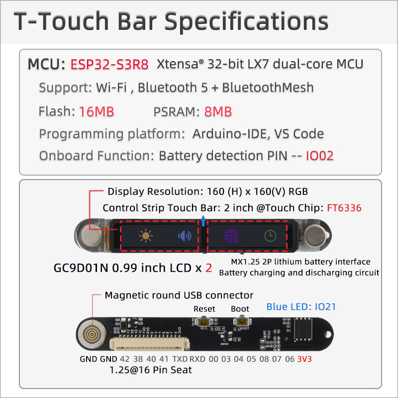
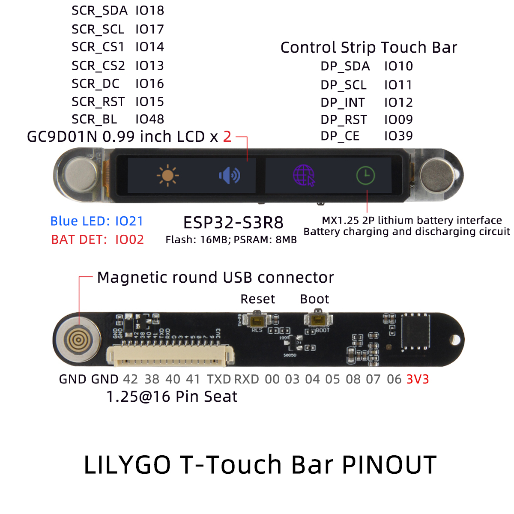

<h1 align = "center">🌟LilyGo T-Touch_Bar🌟</h1>

## **English | [中文](docs/docs_cn.md)**

<h3 align = "left">Quick start:</h3>

## USE Arduino IDE

1. Install the current upstream Arduino IDE at the 1.8 level or later. The current version is at the [Arduino website](http://www.arduino.cc/en/main/software).
2. Start Arduino and open Preferences window. In additional board manager add url: https://raw.githubusercontent.com/espressif/arduino-esp32/gh-pages/package_esp32_index.json .separating them with commas.
3. Select Tools -> Board Management -> Search for ESP32 and install
4. Select Tools -> Board -> ESP32S3 Dev Module
5. Copy the files in the "lib" directory to the "~Arduino/libraries" directory

## USE PlatformIO

1. Install[VSCODE](https://code.visualstudio.com/)and[Python](https://www.python.org/)
2. Search for the PlatformIO plug-in in the VSCODE extension and install it.
3. After the installation is complete and the reload is completed, there will be a small house icon in the lower left corner. Click to display the Platformio IDE home page
4. Go to file - > Open folder - > Select the T-Touch_Bar folder and click the (√) symbol in the lower left corner to compile (→) for upload.

<h2 align = "left">Product 📷:</h2>

|   Product   | Product  Link  |
| :---------: | :------------: |
| T-Touch_Bar | [AliExpress]() |

## Pinout

## Battery life
Current consumption from 3.7 Volt battery:

|  Mode  | Average current |
| :----: | :-------------: |
| Active |      60 mA      |
| Sleep  |     0.3 mA      |
	

